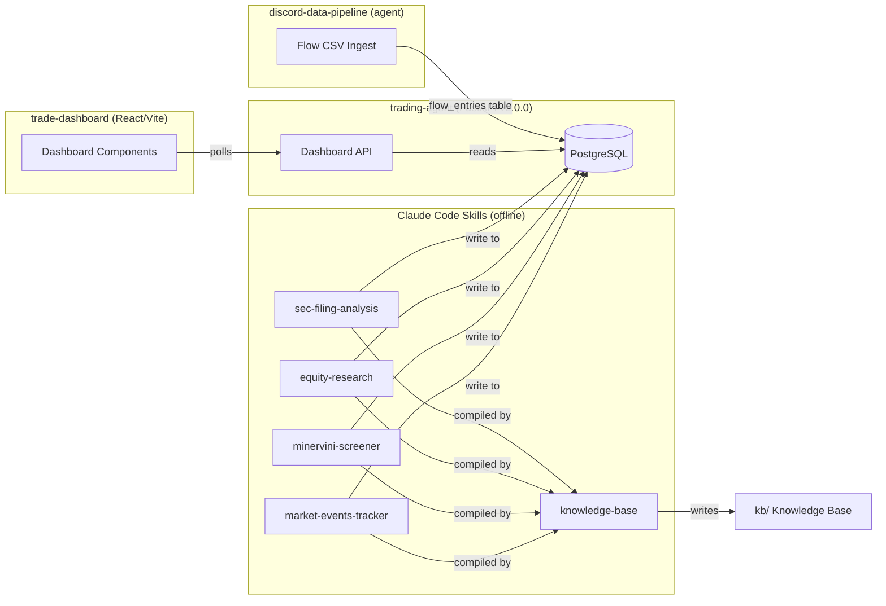

# CLAUDE.md

This file provides guidance to Claude Code (claude.ai/code) when working with code in this repository.

## Architecture

The `trading-agent` codebase is a lean **Dashboard API** (FastAPI v2.0.0) serving the React `trade-dashboard` frontend.
AI analysis is handled offline by **Claude Code skills** writing directly to PostgreSQL, removing the need for server-side LangGraph agents or scheduled pipelines.
A Karpathy-style **knowledge base** (`kb/`) compounds analysis over time as structured markdown.



## Commands

```bash
# Start the backend API server (use tradingbot conda env)
conda run -n tradingbot uvicorn app.main:app --reload

# Start the frontend dashboard (in trade-dashboard repo)
cd /home/rchiluka/workspace/trade-dashboard
npm run dev

# Data refresh pipeline
bash scripts/pg_refresh.sh                          # Load flow CSVs into PostgreSQL
conda run -n tradingbot python3 scripts/walter_enrich.py  # Enrich news via local LLM
conda run -n tradingbot python3 scripts/update_technicals.py  # Fetch MA/RSI/MACD from Massive API

# For technical screen scan 
conda run -n tradingbot python3 scripts/update_technicals.py --mode scan 

# Portfolio optimization (weekly)
conda run -n tradingbot python3 app/services/portfolio-optimizer-hrp.py
conda run -n tradingbot python3 app/services/generate_portfolio_report.py

# Minervini screening (local execution for large universes)
conda run -n tradingbot python3 .claude/skills/minervini-screener/scripts/minervini_screener.py --universe all --json --save

# Save research to PostgreSQL
python3 /tmp/save_research.py <table> <symbol> <date> <html_path>
# table: sec_filing_analysis or equity_research
```

## Daily Workflow for Claude Code

**Before starting:** Read `kb/INDEX.md` for current market context and tracked tickers.

### Step 1: Discord Data Pipeline
Extract Discord flow channels and format into pipe-delimited CSVs.
`@.claude/agents/discord-data-pipeline/SKILL.md`
- CRITICAL: Run all steps of the pipeline (from step 1 - step 5) if you see that the report is not generated for today.
- Outputs to `/media/SHARED/trade-data/formatted/` (golden-sweeps, sweeps, sexy-flow, trady-flow, walter)
- Must run `walter_enrich.py` after formatting (enriches via local LLM on ports 11434/11435)
- Fix carriage returns before pg_refresh: `sed -i 's/\r//g' /media/SHARED/trade-data/formatted/*.csv`


### Step 2: Market Events
Track weekly economic events with outcomes.
`@.claude/skills/market-events-tracker/SKILL.md`
- Check if file already exists at `/media/SHARED/trade-data/market-events/` before regenerating
- Runs on Sunday night for the upcoming week, then Mon-Fri for outcome updates

### Step 3: Data Refresh
Load formatted CSVs into PostgreSQL.
```bash
bash scripts/pg_refresh.sh
```
- Truncate-reloads: golden_sweeps, sweeps, trady_flow, sexy_flow, walter, walter_openai
- Run `update_technicals.py` after to populate `ta_daily` and `ohlc_daily`
- Verify `ta_daily` freshness before running Minervini (data must be current day)
- For stocks that pass technicals - run `conda run -n tradingbot python3 scripts/update_technicals.py --mode scan` - outputs to stdout 

### Step 4: Technical Scan
Minervini SEPA 8-criteria screening.
`@.claude/skills/minervini-screener/SKILL.md`
- Uses all tickers from `ta_daily` table (no hardcoded watchlists)
- Writes results to `dashboard.minervini_tracker`
- fetch the results for Minervini i.e the Minervini tickers, new additions, removals etc from postgres table `dashboard.minervini_tracker` 

### Step 5: Fundamental Analysis
Run on tickers surfaced by steps 1-4 (top Minervini passers, heavy flow names, HRP alpha leaders).
`@.claude/skills/sec-filing-analysis/SKILL.md`
`@.claude/skills/equity-research/SKILL.md`
- output the reasoning on why you picked specific stocks for Fundamental Analysis - specific datapoints, news, analysis etc 
- Check DB freshness first: `SELECT symbol, run_date FROM dashboard.sec_filing_analysis WHERE symbol = '{TICKER}' ORDER BY run_date DESC LIMIT 1`
- Skip if <7 days old with no new material info (earnings, guidance, analyst changes)
- Generates self-contained HTML reports saved to PostgreSQL via `save_research.py`
- MCP postgres is **read-only** — use SQLAlchemy helper for writes

### Step 6: Portfolio Optimization (Weekly — last trading session)
HRP optimizer + thematic overlay + reports.
```bash
conda run -n tradingbot python3 app/services/portfolio-optimizer-hrp.py
conda run -n tradingbot python3 scripts/fetch_consensus.py --top 50
conda run -n tradingbot python3 scripts/portfolio_overlay.py
conda run -n tradingbot python3 app/services/generate_portfolio_report.py
```
- Calculates alpha/beta/volume metrics for full universe
- Builds 3 HRP portfolios (1M/YTD/1Y horizons)
- Fetches Benzinga analyst consensus for top 50 liquid tickers → `dashboard.analyst_consensus`
- Applies thematic overlay (KB themes) + consensus weighting + macro hedge allocation (GLD/TLT/etc based on regime) → `dashboard.portfolio_adjusted`
- Generates strategic audit, momentum audit, and next-leader scout
- Outputs to `app/services/bot_outputs/`

### Step 7: Knowledge Base Compilation
Synthesize all outputs into the persistent knowledge base.
`@.claude/skills/knowledge-base/SKILL.md`
- Reads outputs from steps 1-6, compiles into `kb/` markdown files
- Creates new ticker entries if new tickers were analyzed
- Updates indexes, decision log, themes, and cross-references
- Skip if no new data today

## Knowledge Base

The `kb/` directory is a Karpathy-style structured markdown wiki that compounds trading analysis over time.

**At session start, read `kb/INDEX.md`** for current market context, tracked tickers, active themes, and recent decisions. Read deeper files only as needed.

```
kb/
├── INDEX.md              # Master index — read FIRST every session
├── DECISION_LOG.md       # Recommendations + outcomes tracking
├── tickers/{TICKER}/     # Per-ticker analysis (6 files each)
│   ├── profile.md        # Thesis, bull/bear, competitive position
│   ├── fundamentals.md   # Revenue, margins, FCF, valuation, SEC risk
│   ├── technicals.md     # Minervini status, MA levels, RS, stage
│   ├── flow.md           # Options flow patterns and bias
│   ├── catalysts.md      # Upcoming events with dates
│   └── log.md            # Append-only chronological updates
├── themes/               # Cross-ticker investment themes
├── macro/                # Market regime + weekly digests
└── templates/            # Reference templates for new entries
```

**Rules:** Synthesize, don't copy. Append, don't replace. Always update indexes. Link everything.

## Skills & Agents

### Skills (`.claude/skills/`)

Skills are invoked via `/skill-name` and write results to PostgreSQL or the knowledge base. All file paths in SKILL.md are relative to the skill's directory — always resolve to absolute paths before executing.

| Skill | Purpose | Output |
|-------|---------|--------|
| `minervini-screener` | 8-criteria SEPA Trend Template screening | `dashboard.minervini_tracker` |
| `sec-filing-analysis` | Form 4 insider trading, 10-K risk factors, red flags | `dashboard.sec_filing_analysis` (HTML) |
| `equity-research` | Fundamental + macro + catalyst analysis | `dashboard.equity_research` (HTML) |
| `market-events-tracker` | Weekly market events calendar with outcomes | `/media/SHARED/trade-data/market-events/` (HTML) |
| `knowledge-base` | Compile daily analysis into persistent markdown KB | `kb/` directory |

### Agents (`.claude/agents/`)
| Agent | Purpose |
|-------|---------|
| `discord-data-pipeline` | Export Discord channels → format into CSVs |

## Scripts

| Script | Purpose | When |
|--------|---------|------|
| `scripts/pg_refresh.sh` | Load 6 flow CSVs into PostgreSQL (truncate-reload) + post-refresh jobs | After Discord export |
| `scripts/update_technicals.py` | Fetch SMA/EMA/RSI/MACD via yfinance �� `ta_daily` + 7 scanners | After pg_refresh |
| `scripts/walter_enrich.py` | Enrich news via local LLM (Ollama) → `walter_openai.csv` | After Discord export |
| `scripts/flow_aggregator.py` | Aggregate flow from all channels (source of truth for premium numbers) | Daily |
| `scripts/persist_sector_flow.py` | Aggregate flow by sector → `dashboard.sector_flow_history` | Auto (pg_refresh) |
| `scripts/generate_alerts.py` | Detect daily changes → `dashboard.stock_alerts` | Auto (pg_refresh) |
| `scripts/fetch_consensus.py` | Benzinga analyst consensus → `dashboard.analyst_consensus` | Weekly (before overlay) |
| `scripts/portfolio_overlay.py` | Thematic + consensus + macro hedge overlay → `dashboard.portfolio_adjusted` | Weekly (after HRP) |
| `scripts/sector-analysis.py` | Sector rotation vs benchmark correlation | Weekly |
| `scripts/proofread_report.py` | Validate reports against flow_aggregator output | Before finalizing |

## Database Schema

### PostgreSQL Tables (key tables)

**Flow & News:**
- `flow_entries` — Options flow from 4 Discord channels (golden_sweep, sweep, sexy_flow, trady_flow)
- `news_entries` — Walter news with sentiment, tickers, entities

**Technical Data:**
- `ta_daily` — Daily technicals (SMA, EMA, RSI, MACD, Minervini score)
- `ohlc_daily` — Daily OHLC + volume

**Skill Outputs (dashboard schema):**
- `dashboard.minervini_tracker` — Longitudinal Minervini scan results
- `dashboard.sec_filing_analysis` — SEC analysis HTML (UNIQUE symbol + run_date)
- `dashboard.equity_research` — Equity research HTML (UNIQUE symbol + run_date)
- `dashboard.skill_outputs` — Generic skill output persistence (JSONB)
- `dashboard.sector_flow_history` — Sector bull/bear premium time-series
- `dashboard.stock_alerts` — Dynamic change detection alerts
- `dashboard.analyst_consensus` — Benzinga consensus ratings + price targets (UNIQUE ticker + fetch_date)
- `dashboard.portfolio_adjusted` — Post-HRP adjusted weights with thematic/consensus/hedge overlay

## MCP Servers

Configured in `.mcp.json`. Secrets referenced as `${VAR}` resolved from `.env`.

| Server | Purpose | Notes |
|--------|---------|-------|
| `massive` | Polygon + Benzinga data (prices, news, ratings, earnings, financials) | Options Basic: 5 calls/min, EOD data |
| `postgres` | PostgreSQL queries via MCP | **Read-only** — use SQLAlchemy for writes |

## Data Locations

| Data | Location |
|------|----------|
| Flow CSVs (golden source) | `/media/SHARED/trade-data/formatted/` |
| Market events HTML | `/media/SHARED/trade-data/market-events/` |
| HRP outputs | `app/services/bot_outputs/` |
| Knowledge base | `kb/` |
| Minervini results | `/media/SHARED/trade-data/minervini/` + PG |

## Key Guardrails

- **No hardcoded watchlists.** Tickers come from analysis (flow, Minervini, HRP), never static lists.
- **Always use `flow_aggregator.py`** for premium numbers. Never calculate inline.
- **Check existing state** before each workflow step. Don't regenerate what already exists.
- **Verify `ta_daily` freshness** before running Minervini screener.
- **MCP postgres is read-only.** Use `save_research.py` or SQLAlchemy for INSERT/UPDATE.
- **Fix carriage returns** in CSVs before pg_refresh: `sed -i 's/\r//g' *.csv`
- **Massive API rate limit:** 5 calls/min on Options Basic plan.
